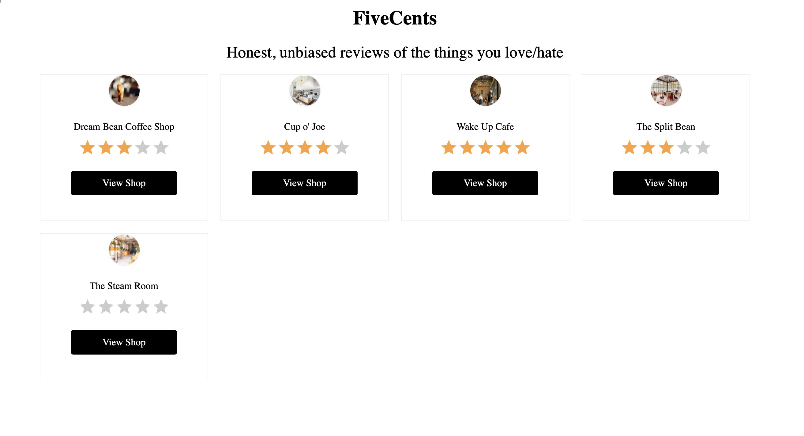
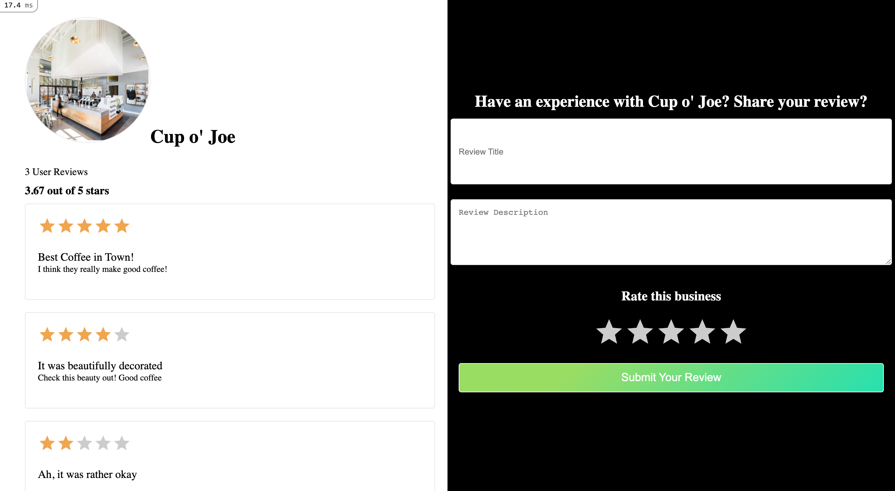

# README
<p align='center'>
  
</p>

# FiveCents

FiveCents is a business reviews app built using Ruby on Rails on the backend and React Typescript on the frontend. Come leave a review!
 

## Technologies
* <a href="https://www.typescriptlang.org/"></a>
* <a href="https://www.postgresql.org/"></a>
* <a href="https://nodejs.org/"></a>
* <a href="https://reactjs.org/"></a>
* <a href="https://developer.mozilla.org/en-US/docs/Web/CSS"></a>
* <a href="https://www.ruby-lang.org/en/"></a>
* <a href="https://rubyonrails.org/"></a>


## Features

### View all businesses
View all the businesses listed on the home page



### View business && Create a Review
Be able to view specific business, the reviews other have left, and leave your own review



## Installation
To build/run project locally, please follow these steps:

1. Clone this repository

```shell
git clone https://github.com/Simonvargas/FiveCents.git
```

2. Install dependencies 
```shell
bundle install
npm install
```

4. Setup your PostgreSQL 

```
rails db:migrate
rails db:seed
```
5. Start the server
```
rails s
```


## Contact

### Simon Vargas
<a href="https://www.linkedin.com/in/simon-vargas-aa0b6a14b/"></a>
<a href="https://angel.co/u/simon-vargas"></a>
<a href="https://github.com/Simonvargas"></a>

simonvargas01@gmail.com
